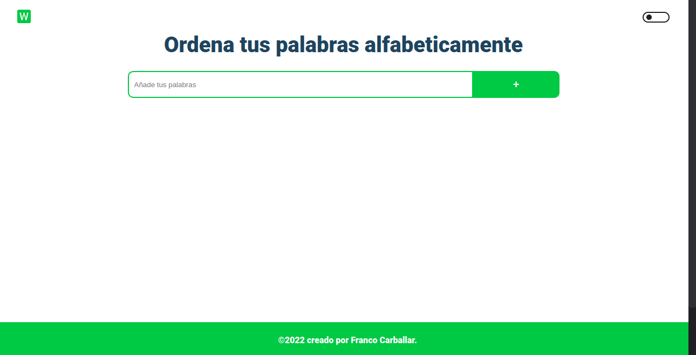
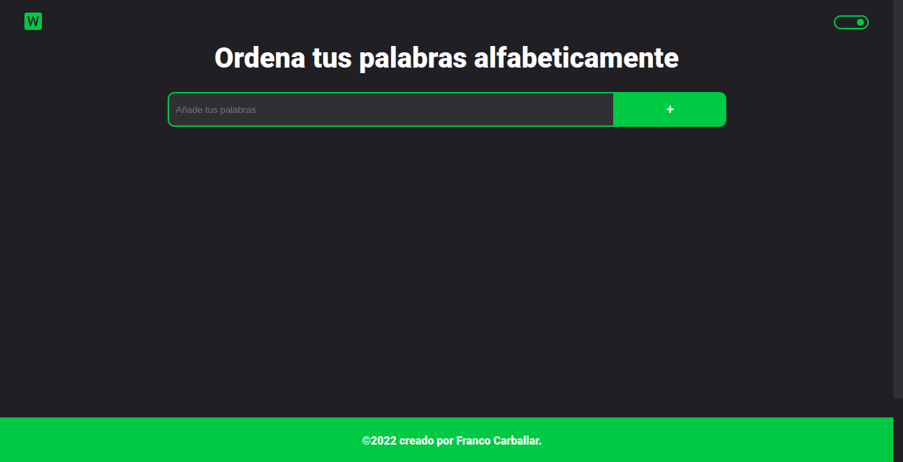
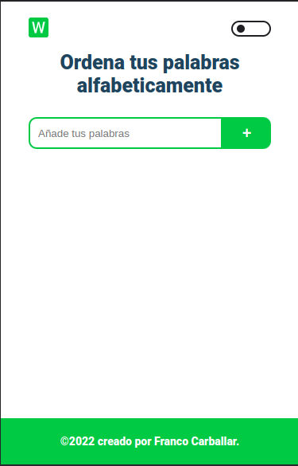
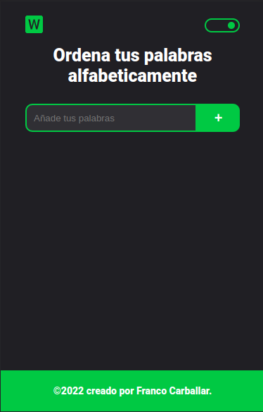

# Palabras en orden alfabético
El orden alfabético es la secuencia que se establece en una lista de palabras, en función del orden en que se presenta, ​ en el abecedario o alfabeto, la letra inicial de cada una.

## Ver está página:
https://francocarballar.github.io/palabras-en-orden-alfabetico/

## Tecnologías utilizadas:
- HTML
- CSS
- Responsive Design (Siguiendo la metodología de Mobile First)
- JavaScript

## Habilidades adquiridas: 
Es un sencillo programa que ordena las palabras por orden alfabético. Me sirvió para prácticar un poco los conceptos de Arrays.

## Imágenes:
- Desktop: 

- Desktop Dark Mode: 

- Mobile: 

- Mobile Dark Mode: 

### Creado por @francocarballar